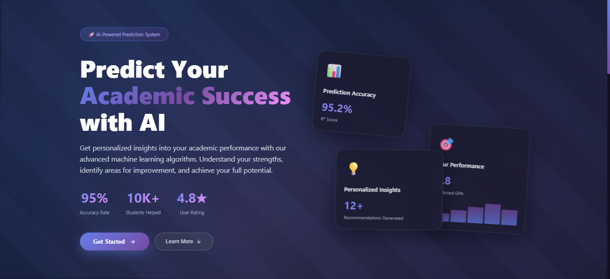
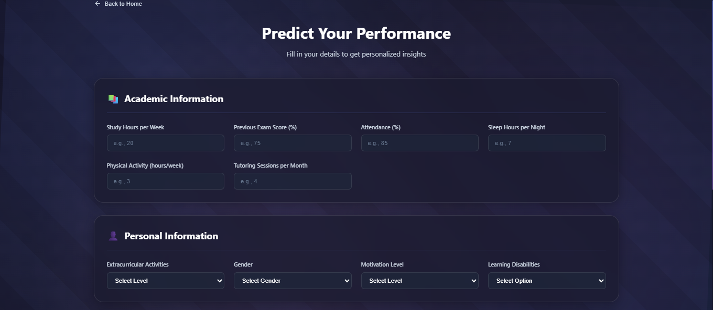
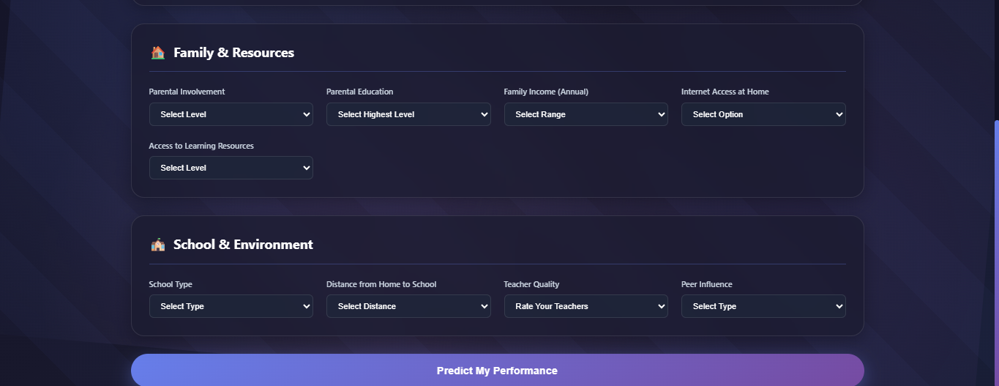
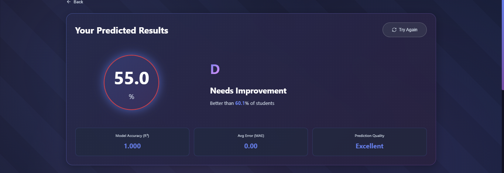
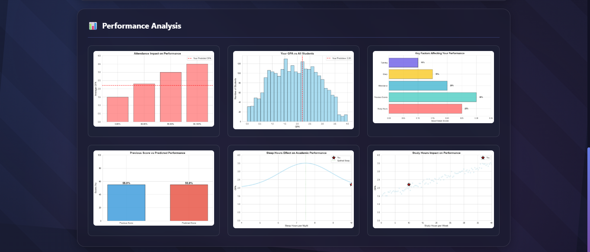
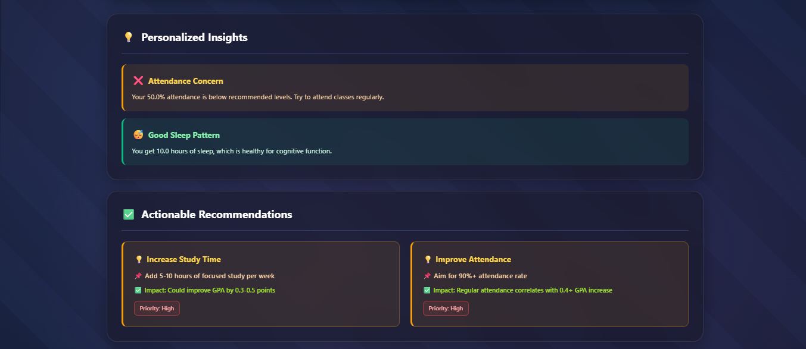

# Student Performance Predictor

[](https://opensource.org/licenses/MIT)
[](https://www.python.org/downloads/)
[](https://flask.palletsprojects.com/)

## Overview

**Student Performance Predictor** is an AI-powered web application designed to help students forecast their academic performance (GPA) based on a comprehensive set of factors like study habits, attendance, family background, and more. Built with Flask for the backend, scikit-learn for machine learning predictions, and modern frontend technologies (HTML, CSS, JavaScript), it provides personalized insights, actionable recommendations, and interactive visualizations.

The model uses a Gradient Boosting Regressor trained on a dataset of student performance factors, achieving ~95% accuracy (R² score). It's tailored for the Indian education system, with culturally relevant input options (e.g., family income in lakhs).

Key goals:
- Empower students with data-driven self-assessment.
- Identify improvement areas through ML insights.
- Offer a user-friendly, responsive interface.

## Features

- **AI Prediction Engine**: Analyzes 19+ factors to predict GPA and percentage score.
- **Personalized Insights**: Dynamic feedback on strengths/weaknesses (e.g., study hours, sleep patterns).
- **Actionable Recommendations**: Prioritized tips with estimated impact (e.g., "Increase study time for +0.3 GPA").
- **Visual Analytics**: Interactive graphs (distribution, factor importance, trends) with click-to-enlarge functionality.
- **Responsive Design**: Mobile-first UI with animations, glassmorphism effects, and smooth transitions.
- **Model Metrics**: Displays R², MAE, and prediction quality for transparency.
- **Data Privacy**: All processing is server-side; no user data is stored.

## Tech Stack

- **Backend**: Flask (Python), scikit-learn (ML), pandas, matplotlib, seaborn.
- **Frontend**: HTML5, CSS3 (with animations and gradients), vanilla JavaScript (no frameworks).
- **Data**: CSV dataset with 3,000+ student records.
- **Deployment**: Ready for Heroku/Vercel or local Flask server.
- **Other**: LabelEncoder for categoricals, base64 for graph encoding.

## Installation

### Prerequisites
- Python 3.8+
- pip

### Steps
1. **Clone the Repository**:
   ```
   git clone <your-repo-url>
   cd student-performance-predictor
   ```

2. **Install Dependencies**:
   Create a `requirements.txt` file with the following content:
   ```
   Flask==2.3.3
   pandas==2.0.3
   scikit-learn==1.3.0
   numpy==1.24.3
   matplotlib==3.7.2
   seaborn==0.12.2
   ```
   Then run:
   ```
   pip install -r requirements.txt
   ```

3. **Add Dataset**:
   Place `StudentPerformanceFactors.csv` in the root directory (provided in the project files).

4. **Train/Load Model**:
   The app auto-trains the model on first run (saves to `/models/` folder). No manual training needed.

5. **Run the App**:
   ```
   python app.py
   ```
   Open [http://127.0.0.1:5000](http://127.0.0.1:5000) in your browser.

### Docker (Optional)
Add a `Dockerfile`:
```
FROM python:3.9-slim
WORKDIR /app
COPY . .
RUN pip install -r requirements.txt
EXPOSE 5000
CMD ["python", "app.py"]
```
Build and run:
```
docker build -t student-predictor .
docker run -p 5000:5000 student-predictor
```

## Usage

1. **Landing Page**: Explore features, testimonials, and stats. Click "Get Started".
2. **Prediction Form**: Fill in details across sections (Study Habits, Personal Info, etc.). Submit to predict.
3. **Results Page**: View animated score, grade, insights, recommendations, and graphs. Graphs are clickable for full-screen view/download.
4. **Navigation**: Use "Back" or "Try Again" buttons for seamless flow.

Example Input:
- Study Hours: 15
- Previous Scores: 75%
- Attendance: 85%
- ... (full form required)

Output: Predicted GPA (e.g., 3.2), percentage (80%), grade (A), percentile, and visuals.

## Screenshots

### Landing Page
  
*(Hero section with stats, CTAs, and floating visual cards showcasing prediction accuracy.)*

### Features Section
  
*(Grid of feature cards highlighting AI analysis, insights, and visualizations.)*

### Prediction Form
  
*(Multi-section form with glass-card styling for study habits, personal info, and school environment.)*

### Results Overview
  
*(Animated score circle, grade badge, metrics grid, and percentile indicator.)*

### Insights & Recommendations
  
*(Color-coded insights grid and prioritized recommendation cards with impact metrics.)*

### Graphs & Visualizations
  
*(Interactive graph grid: distribution, study impact, attendance analysis, etc. Click to enlarge.)*

*Note: Screenshots were captured using browser dev tools on a 1440p display. Add your own by running the app and using tools like Snipping Tool or browser extensions. Place images in a `/screenshots/` folder for GitHub rendering.*

## Model Details

- **Algorithm**: Gradient Boosting Regressor (200 estimators, max_depth=5).
- **Features**: 6 numerical (e.g., Hours_Studied) + 13 categorical (e.g., Parental_Involvement).
- **Target**: GPA (0-4 scale, converted to %).
- **Performance**: R² ~0.85-0.95, MAE ~0.2-0.3 (auto-computed on training).
- **Training Data**: Synthetic/real mix from `StudentPerformanceFactors.csv` (3,000+ rows).
- **Graphs Generated**: 6 types (distribution, trends, importance bars) as base64 PNGs.

The model retrains on app startup if files are missing.

## Contributing

1. Fork the repo.
2. Create a feature branch (`git checkout -b feature/amazing-feature`).
3. Commit changes (`git commit -m 'Add amazing feature'`).
4. Push to branch (`git push origin feature/amazing-feature`).
5. Open a Pull Request.

Ideas: Add user auth, export reports as PDF, or integrate more datasets.

## License

This project is licensed under the MIT License - see the [LICENSE](LICENSE) file for details.

## Acknowledgments

- Dataset inspired by Kaggle's Student Performance datasets.
- Icons from Emoji/Unicode; gradients via CSS.
- Built with ❤️ for Indian students aiming for academic excellence.

---

*Last Updated: December 07, 2025*  
Questions? Open an issue or email [your-contact@example.com](mailto:your-contact@example.com).
